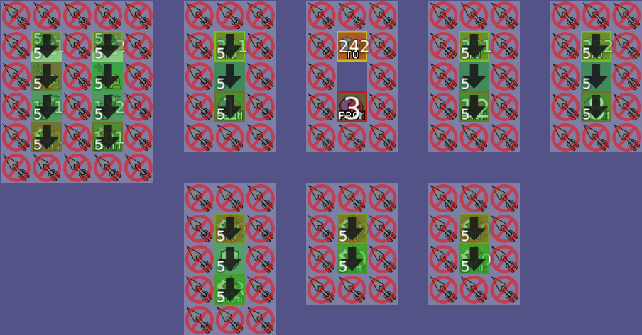

# DDNet HiddenWorld [](https://github.com/ddnet/ddnet/actions?query=workflow%3ABuild+event%3Apush+branch%3Amaster)

My flavor of HiddenWorld, a DDNet mod.

For more information please join my tencent group [DDSM] 492827173.

You can get binary releases on the [Release](https://github.com/landmineHQ/ddnet-hidden/releases).

If you want to mapping, please checkout [here](#mapping), you will see the documentation for mapping.

# Mapping

要制作躲猫猫地图，需要了解躲猫猫的**核心机制**，为方便后续描述，这里将服务器(服务端)简称为**端**或**服务**，客服端(玩家)统一称为**玩家**。

为了使HiddenWorld模式给予地图更多自定义的能力，在**端**中并没有为玩家增加武器、特殊状态、冻结解冻等。**端**中仅做的是分配并传送玩家。
所有的地图规则以及实现都基于DDNet地图实现并且完全兼容DDNet。这意味着你可以使用DDNet的各种机关或特性来制作躲猫猫地图，甚至还能在里面跑图……

相信你已经对HiddenWorld模式有了一定了解，并且已经体验过了***FightFire制作的丛林逐影***、***Wartoz制作的空间消亡***、***画渣制作的十字路口***。

虽然每个地图都有各自的特色与机制，但都将地图大致划分为了五个区域：

- s0.大厅
- s1-s3.投票
- ddnet动画
- s4.大地图
- s5.结算区域

## s0.大厅

s0.大厅是玩家的出生点，通常会有一些介绍或提示的信息。


## s1-s3.投票

s1-s3.投票是玩家进行选择投票的区域，每个区域对应一个投票选项，玩家可以通过进入不同的区域来表达自己的意愿。


## ddnet动画

ddnet动画是向玩家展示了身份背景的动画，通常会有一些音效或文字来增强氛围。


## s4.大地图

s4.大地图是玩家的主要活动场所，通常会有一些机关或障碍物来增加游戏的趣味性和挑战性。


## s5.结算区域

s5.结算区域是对上局游戏的结算，通常会有一些奖励或惩罚的机制来激励玩家。


<br>
<br>
<hr>

为了实现上述功能，不可避免地需要占用地图中的一些信息，端中选择的是占用ddnet地图中的teleout来实现端的传送定位，为了方便描述，将所有被占用的teleout称作"端占用"。

## 端占用

- 200-202
  - 200 s1的传送点
  - 201、202 投票判定点，判定是否开始游戏，但实际上是历史遗留问题，计划跳过或修改投票内容
  - 相关配置

    ```
    hidden_step_vote_s1_a "☺☺☺"
    hidden_step_vote_s1_b "☹☹☹"
    hidden_step_vote_s1_a_value "开始"
    hidden_step_vote_s1_b_value "退出"
    ```

- 210-214
  - 210 s2的传送点
  - 211、212、213、214 投票判定点，判定猎手数量
  - 相关配置

    ```
    hidden_step_vote_s2_a "弃权"
    hidden_step_vote_s2_b "简单"
    hidden_step_vote_s2_c "普通"
    hidden_step_vote_s2_d "困难"
    hidden_step_vote_s2_b_value 1
    hidden_step_vote_s2_c_value 2
    hidden_step_vote_s2_d_value 3
    ```

- 220-224
  - 220 s3的传送点
  - 221、222、223、224 投票判定点，判定设备数量
  - 相关配置

    ```
    hidden_step_vote_s3_a "弃权"
    hidden_step_vote_s3_b "简单"
    hidden_step_vote_s3_c "普通"
    hidden_step_vote_s3_d "困难"
    hidden_step_vote_s3_b_value 30
    hidden_step_vote_s3_c_value 60
    hidden_step_vote_s3_d_value 90
    ```

- 231-232  
  - 231 逃生者传送点
  - 232 猎手传送点
  - 相关配置

    ```
    hidden_step_vote_result_conclusion "\n"
    hidden_step_vote_result_conclusion_seeker_prefix "猎手"
    hidden_step_vote_result_conclusion_hider_prefix "逃生者"
    hidden_step_tips_s4_a1 "身份：猎手"
    hidden_step_tips_s4_a2 "猎手：使用锤子击杀求生者"
    hidden_step_tips_s4_b1 "身份：逃生者"
    hidden_step_tips_s4_b2 "逃生者：使用散弹枪激活机器"
    ```

- 241-242
  - 241 设备重生点
  - 242 设备激活传送点
  - 相关配置

    ```
    hidden_step_player_gameover_msg "出局了!"
    hidden_step_player_gameover_chat_msg "游戏结束后复活"
    hidden_step_player_gameover_chat_msg_2 "剩余人数"
    hidden_step_player_waiting_msg "等待加入"
    hidden_step_player_num_error_msg "人数异常，游戏结束"
    hidden_step_left_time_to_active_device_msg_prefix "必须有设备在"
    hidden_step_left_time_to_active_device_msg_suffix "秒内激活"
    hidden_step_device_activated_progress_msg "设备激活进度："
    hidden_step_device_compass_activated_whisper_msg "指南针已激活"

    hidden_spectator_seeker_name ">>> 猎手 <<<"
    ```

- 251-252
  - 251 胜利玩家传送点
  - 252 失败玩家传送点
  - 相关配置

    ```
    hidden_seeker_win ">>> 猎手胜利 <<<"
    hidden_hider_win ">>> 逃生者胜利 <<<"
    ```

- 额外配置

  ```
  # before game start
  hidden_time_left_start_msg_prefix "游戏将在"
  hidden_time_left_start_msg_suffix "秒后开始"

  hidden_auto_start_desc "自动开始"
  hidden_auto_start_cmd "hidden_toggle 1"
  hidden_auto_start_reason "……"
  hidden_auto_start_Chatmsg "按下F3同意开始游戏"

  hidden_time_left_msg_prefix "还剩:"
  hidden_time_left_msg_suffix "秒"

  hidden_not_enough_players_msg_prefix "当前人数:"
  hidden_not_enough_players_msg_suffix " 至少需要2人才能开始游戏!"

  hidden_duration_s0 60
  hidden_duration_s1 10
  hidden_duration_s2 10
  hidden_duration_s3 10
  hidden_duration_s4 120
  hidden_duration_s4_normal 300

  hidden_machine_name "设备"
  hidden_machine_skin_name "Robot"

  hidden_step_vote_result_msg "投票结果: "
  hidden_step_vote_result_msg_too_many_seekers "猎人数量过高!"

  # some tips
  hidden_cant_see_msg "... [您无法查看此消息]"
  hidden_cant_chat_in_team_msg "你不能进行队伍聊天"
  hidden_cant_use_dummy_msg "此地图不支持多客户端!"
  hidden_cant_use_pause_msg "不可切换"
  ```

由于定点传送会将所有的玩家传送到同一个teleout，请遵守以下制图规范来避免产生BUG：

1. 将端占用集成到同一个区域，方便维护与管理
  
2. 端占用的格子必须以无碰撞开始，恢复碰撞结束
  
3. 任何效果都必须成对出现，如果你给予了玩家永冻，那么必须在投票的阶段进行恢复。同样，给予了玩家无锤子的buff，那么必须在投票的阶段进行恢复。
4. 你不必将投票的端占用水平放置，你可以随意放置。
  
5. 端支持在地图中修改默认文本以及默认难度，你可在[端占用](#端占用)中了解到详情

## 配置

默认所有HiddenWorld配置均可通过地图中的server settings进行修改，hidden_skins暂时不可修改。
配置使用方式如下：


# Cloning

To clone this repository with full history and external libraries (~350 MB):

    git clone --recursive https://github.com/landmineHQ/ddnet-hidden

To clone this repository with full history when you have the necessary libraries on your system already (~220 MB):

    git clone https://github.com/landmineHQ/ddnet-hidden

To clone this repository with history since we moved the libraries to <https://github.com/ddnet/ddnet-libs> (~40 MB):

    git clone --shallow-exclude=included-libs https://github.com/landmineHQ/ddnet-hidden

To clone the libraries if you have previously cloned DDNet without them, or if you require the ddnet-libs history instead of a shallow clone:

    git submodule update --init --recursive

# Dependencies on Linux / macOS

You can install the required libraries on your system, `touch CMakeLists.txt` and CMake will use the system-wide libraries by default. You can install all required dependencies and CMake on Debian or Ubuntu like this:

    sudo apt install build-essential cargo cmake git glslang-tools google-mock libavcodec-extra libavdevice-dev libavfilter-dev libavformat-dev libavutil-dev libcurl4-openssl-dev libfreetype6-dev libglew-dev libnotify-dev libogg-dev libopus-dev libopusfile-dev libpng-dev libsdl2-dev libsqlite3-dev libssl-dev libvulkan-dev libwavpack-dev libx264-dev python3 rustc spirv-tools

On older distributions like Ubuntu 18.04 don't install `google-mock`, but instead set `-DDOWNLOAD_GTEST=ON` when building to get a more recent gtest/gmock version.

On older distributions `rustc` version might be too old, to get an up-to-date Rust compiler you can use [rustup](https://rustup.rs/) with stable channel instead or try the `rustc-mozilla` package.

Or on CentOS, RedHat and AlmaLinux like this:

    sudo yum install cargo cmake ffmpeg-devel freetype-devel gcc gcc-c++ git glew-devel glslang gmock-devel gtest-devel libcurl-devel libnotify-devel libogg-devel libpng-devel libx264-devel make openssl-devel opus-devel opusfile-devel python2 rust SDL2-devel spirv-tools sqlite-devel vulkan-devel wavpack-devel

Or on Fedora like this:

    sudo dnf install cargo cmake ffmpeg-devel freetype-devel gcc gcc-c++ git glew-devel glslang gmock-devel gtest-devel libcurl-devel libnotify-devel libogg-devel libpng-devel make openssl-devel opus-devel opusfile-devel python2 SDL2-devel spirv-tools sqlite-devel vulkan-devel wavpack-devel x264-devel

Or on Arch Linux like this:

    sudo pacman -S --needed base-devel cmake curl ffmpeg freetype2 git glew glslang gmock libnotify libpng opusfile python rust sdl2 spirv-tools sqlite vulkan-headers vulkan-icd-loader wavpack x264

Or on Gentoo like this:

    emerge --ask dev-db/sqlite dev-lang/rust-bin dev-libs/glib dev-libs/openssl dev-util/glslang dev-util/spirv-headers dev-util/spirv-tools media-libs/freetype media-libs/glew media-libs/libglvnd media-libs/libogg media-libs/libpng media-libs/libsdl2 media-libs/libsdl2[vulkan] media-libs/opus media-libs/opusfile media-libs/pnglite media-libs/vulkan-loader[layers] media-sound/wavpack media-video/ffmpeg net-misc/curl x11-libs/gdk-pixbuf x11-libs/libnotify

On macOS you can use [homebrew](https://brew.sh/) to install build dependencies like this:

    brew install cmake ffmpeg freetype glew glslang googletest libpng molten-vk opusfile rust SDL2 spirv-tools vulkan-headers wavpack x264

If you don't want to use the system libraries, you can pass the `-DPREFER_BUNDLED_LIBS=ON` parameter to cmake.

# Building on Linux and macOS

To compile DDNet yourself, execute the following commands in the source root:

    mkdir build
    cd build
    cmake ..
    make -j$(nproc)

Pass the number of threads for compilation to `make -j`. `$(nproc)` in this case returns the number of processing units.

DDNet requires additional libraries, some of which are bundled for the most common platforms (Windows, Mac, Linux, all x86 and x86\_64) for convenience and the official builds. The bundled libraries for official builds are now in the ddnet-libs submodule. Note that when you build and develop locally, you should ideally use your system's package manager to install the dependencies, instead of relying on ddnet-libs submodule, which does not contain all dependencies anyway (e.g. openssl, vulkan). See the previous section for how to get the dependencies. Alternatively see the following build arguments for how to disable some features and their dependencies (`-DVULKAN=OFF` won't require Vulkan for example).

The following is a non-exhaustive list of build arguments that can be passed to the `cmake` command-line tool in order to enable or disable options in build time:

- **-DCMAKE_BUILD_TYPE=[Release|Debug|RelWithDebInfo|MinSizeRel]** <br>
An optional CMake variable for setting the build type. If not set, defaults to "Release" if `-DDEV=ON` is **not** used, and "Debug" if `-DDEV=ON` is used. See `CMAKE_BUILD_TYPE` in CMake Documentation for more information.

- **-DPREFER_BUNDLED_LIBS=[ON|OFF]** <br>
Whether to prefer bundled libraries over system libraries. Setting to ON will make DDNet use third party libraries available in the `ddnet-libs` folder, which is the git-submodule target of the [ddnet-libs](https://github.com/ddnet/ddnet-libs) repository mentioned above -- Useful if you do not have those libraries installed and want to avoid building them. If set to OFF, will only use bundled libraries when system libraries are not found. Default value is OFF.

- **-DWEBSOCKETS=[ON|OFF]** <br>
Whether to enable WebSocket support for server. Setting to ON requires the `libwebsockets-dev` library installed. Default value is OFF.

- **-DMYSQL=[ON|OFF]** <br>
Whether to enable MySQL/MariaDB support for server. Requires at least MySQL 8.0 or MariaDB 10.2. Setting to ON requires the `libmariadbclient-dev` library installed, which are also provided as bundled libraries for the common platforms. Default value is OFF.

   Note that the bundled MySQL libraries might not work properly on your system. If you run into connection problems with the MySQL server, for example that it connects as root while you chose another user, make sure to install your system libraries for the MySQL client. Make sure that the CMake configuration summary says that it found MySQL libs that were not bundled (no "using bundled libs").

- **-DTEST_MYSQL=[ON|OFF]** <br>
Whether to test MySQL/MariaDB support in GTest based tests. Default value is OFF.

   Note that this requires a running MySQL/MariaDB database on localhost with this setup:

```

CREATE DATABASE ddnet;
CREATE USER 'ddnet'@'localhost' IDENTIFIED BY 'thebestpassword';
GRANT ALL PRIVILEGES ON ddnet.* TO 'ddnet'@'localhost';
FLUSH PRIVILEGES;

```

- **-DAUTOUPDATE=[ON|OFF]** <br>
Whether to enable the autoupdater. Packagers may want to disable this for their packages. Default value is ON for Windows and Linux.

- **-DCLIENT=[ON|OFF]** <br>
Whether to enable client compilation. If set to OFF, DDNet will not depend on Curl, Freetype, Ogg, Opus, Opusfile, and SDL2. Default value is ON.

- **-DVIDEORECORDER=[ON|OFF]** <br>
Whether to add video recording support using FFmpeg to the client. Default value is ON.

- **-DDOWNLOAD_GTEST=[ON|OFF]** <br>
Whether to download and compile GTest. Useful if GTest is not installed and, for Linux users, there is no suitable package providing it. Default value is OFF.

- **-DDEV=[ON|OFF]** <br>
Whether to optimize for development, speeding up the compilation process a little. If enabled, don't generate stuff necessary for packaging. Setting to ON will set CMAKE\_BUILD\_TYPE to Debug by default. Default value is OFF.

- **-DUPNP=[ON|OFF]** <br>
Whether to enable UPnP support for the server.
You need to install `libminiupnpc-dev` on Debian, `miniupnpc` on Arch Linux.
Default value is OFF.

- **-DVULKAN=[ON|OFF]** <br>
Whether to enable the vulkan backend.
On Windows you need to install the Vulkan SDK and set the `VULKAN_SDK` environment flag accordingly.
Default value is ON for Windows x86\_64 and Linux, and OFF for Windows x86 and macOS.

- **-GNinja** <br>
Use the Ninja build system instead of Make. This automatically parallelizes the build and is generally faster. Compile with `ninja` instead of `make`. Install Ninja with `sudo apt install ninja-build` on Debian, `sudo pacman -S --needed ninja` on Arch Linux.

- **-DCMAKE_CXX_LINK_FLAGS=[FLAGS]** <br>
Custom flags to set for compiler when linking.

- **-DEXCEPTION_HANDLING=[ON|OFF]** <br>
Enable exception handling (only works with Windows as of now, uses DrMingw there). Default value is OFF.

- **-DIPO=[ON|OFF]** <br>
Enable interprocedural optimizations, also known as Link Time Optimization (LTO). Default value is OFF.

- **-DFUSE_LD=[OFF|LINKER]** <br>
Linker to use. Default value is OFF to try mold, lld, gold.

- **-DSECURITY_COMPILER_FLAGS=[ON|OFF]** <br>
Whether to set security-relevant compiler flags like `-D_FORTIFY_SOURCE=2` and `-fstack-protector-all`. Default Value is ON.

# Running tests (Debian/Ubuntu)

In order to run the tests, you need to install the following library `libgtest-dev`.

This library isn't compiled, so you have to do it:

```bash
sudo apt install libgtest-dev
cd /usr/src/gtest
sudo cmake CMakeLists.txt
sudo make -j$(nproc)

# copy or symlink libgtest.a and libgtest_main.a to your /usr/lib folder
sudo cp lib/*.a /usr/lib
```

To run the tests you must target `run_tests` with make:
`make run_tests`

# Code formatting

We use clang-format 10 to format the C++ code of this project. Execute `scripts/fix_style.py` after changing the code to ensure code is formatted properly, a GitHub central style checker will do the same and prevent your change from being submitted.

On Arch Linux you can install clang-format 10 using the [clang-format-static-bin AUR package](https://aur.archlinux.org/packages/clang-format-static-bin/). On macOS you can install clang-format 10 using a [homebrew tap](https://github.com/r-lib/homebrew-taps):

```bash
brew install r-lib/taps/clang-format@10
sudo ln -s /opt/homebrew/Cellar/clang-format@10/10.0.1/bin/clang-format /opt/homebrew/bin/clang-format-10
```

# Using AddressSanitizer + UndefinedBehaviourSanitizer or Valgrind's Memcheck

ASan+UBSan and Memcheck are useful to find code problems more easily. Please use them to test your changes if you can.

For ASan+UBSan compile with:

```bash
CC=clang CXX=clang++ CXXFLAGS="-fsanitize=address,undefined -fsanitize-recover=address,undefined -fno-omit-frame-pointer" CFLAGS="-fsanitize=address,undefined -fsanitize-recover=address,undefined -fno-omit-frame-pointer" cmake -DCMAKE_BUILD_TYPE=Debug .
make
```

and run with:

```bash
UBSAN_OPTIONS=suppressions=./ubsan.supp:log_path=./SAN:print_stacktrace=1:halt_on_errors=0 ASAN_OPTIONS=log_path=./SAN:print_stacktrace=1:check_initialization_order=1:detect_leaks=1:halt_on_errors=0 LSAN_OPTIONS=suppressions=./lsan.supp ./DDNet
```

Check the SAN.\* files afterwards. This finds more problems than memcheck, runs faster, but requires a modern GCC/Clang compiler.

For valgrind's memcheck compile a normal Debug build and run with: `valgrind --tool=memcheck ./DDNet`
Expect a large slow down.

# Building on Windows with Visual Studio

Download and install some version of [Microsoft Visual Studio](https://www.visualstudio.com/) (as of writing, MSVS Community 2017) with **C++ support**, install [Python 3](https://www.python.org/downloads/) **for all users** and install [CMake](https://cmake.org/download/#latest). You also need to install [Rust](https://rustup.rs/).

Start CMake and select the source code folder (where DDNet resides, the directory with `CMakeLists.txt`). Additionally select a build folder, e.g. create a build subdirectory in the source code directory. Click "Configure" and select the Visual Studio generator (it should be pre-selected, so pressing "Finish" will suffice). After configuration finishes and the "Generate" reactivates, click it. When that finishes, click "Open Project". Visual Studio should open. You can compile the DDNet client by right-clicking the "game-client" project and select "Set as Startup project". Now you should be able to compile DDNet by clicking the green, triangular "Run" button.

# Cross-compiling on Linux to Windows x86/x86\_64

Install MinGW cross-compilers of the form `i686-w64-mingw32-gcc` (32 bit) or
`x86_64-w64-mingw32-gcc` (64 bit). This is probably the hard part. ;)

Then add `-DCMAKE_TOOLCHAIN_FILE=../cmake/toolchains/mingw64.toolchain` to the
**initial** CMake command line.

# Cross-compiling on Linux to WebAssembly via Emscripten

Install Emscripten cross-compilers (e.g. `sudo apt install emscripten`) on a modern linux distro.

If you need to compile the ddnet-libs for WebAssembly, simply call

```bash
# <directory to build in> should be a directory outside of the project's source directory
scripts/compile_libs/gen_libs.sh <directory to build in> webasm
```

from the project's source directory. It will automatically create a directory called `ddnet-libs`.
You can then manually merge this directory with the one in the ddnet source directory.

Then run `emcmake cmake .. -DVIDEORECORDER=OFF -DVULKAN=OFF -DSERVER=OFF -DTOOLS=OFF -DPREFER_BUNDLED_LIBS=ON` in your build directory.

To test the compiled code locally, just use `emrun --browser firefox DDNet.html`

To host the compiled .html file copy all `.data`, `.html`, `.js`, `.wasm` files to the web server. (see /other/emscripten/minimal.html for a minimal html example)

Then enable cross origin policies. Example for apache2 on debian based distros:

```bash
sudo a2enmod header

# edit the apache2 config to allow .htaccess files
sudo nano /etc/apache2/apache2.conf

# set AllowOverride to All for your directory
# then create a .htaccess file on the web server (where the .html is)
# and add these lines
Header add Cross-Origin-Embedder-Policy "require-corp"
Header add Cross-Origin-Opener-Policy "same-origin"

# now restart apache2
sudo service apache2 restart
```

# Cross-compiling on Linux to macOS

Install [osxcross](https://github.com/tpoechtrager/osxcross), then add
`-DCMAKE_TOOLCHAIN_FILE=../cmake/toolchains/darwin.toolchain` and
`-DCMAKE_OSX_SYSROOT=/path/to/osxcross/target/SDK/MacOSX10.11.sdk/` to the
**initial** CMake command line.

Install `dmg` and `hfsplus` from
[libdmg-hfsplus](https://github.com/mozilla/libdmg-hfsplus) and `newfs_hfs`
from
[diskdev\_cmds](http://pkgs.fedoraproject.org/repo/pkgs/hfsplus-tools/diskdev_cmds-540.1.linux3.tar.gz/0435afc389b919027b69616ad1b05709/diskdev_cmds-540.1.linux3.tar.gz)
to unlock the `package_dmg` target that outputs a macOS disk image.

# Importing the official DDNet Database

```bash
$ wget https://ddnet.org/stats/ddnet-sql.zip
$ unzip ddnet-sql.zip
$ yaourt -S mariadb mysql-connector-c++
$ mysql_install_db --user=mysql --basedir=/usr --datadir=/var/lib/mysql
$ systemctl start mariadb
$ mysqladmin -u root password 'PW'
$ mysql -u root -p'PW'
MariaDB [(none)]> create database teeworlds; create user 'teeworlds'@'localhost' identified by 'PW2'; grant all privileges on teeworlds.* to 'teeworlds'@'localhost'; flush privileges;
# this takes a while, you can remove the KEYs in record_race.sql to trade performance in queries
$ mysql -u teeworlds -p'PW2' teeworlds < ddnet-sql/record_*.sql

$ cat mine.cfg
sv_use_sql 1
add_sqlserver r teeworlds record teeworlds "PW2" "localhost" "3306"
add_sqlserver w teeworlds record teeworlds "PW2" "localhost" "3306"

$ mkdir build
$ cd build
$ cmake -DMYSQL=ON ..
$ make -j$(nproc)
$ ./DDNet-Server -f mine.cfg
```

<a href="https://repology.org/metapackage/ddnet/versions">
    
</a>

# Benchmarking

DDNet is available in the [Phoronix Test Suite](https://openbenchmarking.org/test/pts/ddnet). If you have PTS installed you can easily benchmark DDNet on your own system like this:

```bash
phoronix-test-suite benchmark ddnet
```

# Better Git Blame

First, use a better tool than `git blame` itself, e.g. [`tig`](https://jonas.github.io/tig/). There's probably a good UI for Windows, too. Alternatively, use the GitHub UI, click "Blame" in any file view.

For `tig`, use `tig blame path/to/file.cpp` to open the blame view, you can navigate with arrow keys or kj, press comma to go to the previous revision of the current line, q to quit.

Only then you could also set up git to ignore specific formatting revisions:

```bash
git config blame.ignoreRevsFile formatting-revs.txt
```

# (Neo)Vim Syntax Highlighting for config files

Copy the file detection and syntax files to your vim config folder:

```bash
# vim
cp -R other/vim/* ~/.vim/

# neovim
cp -R other/vim/* ~/.config/nvim/
```
